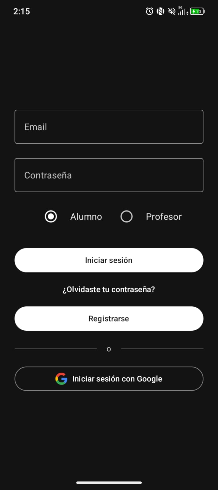
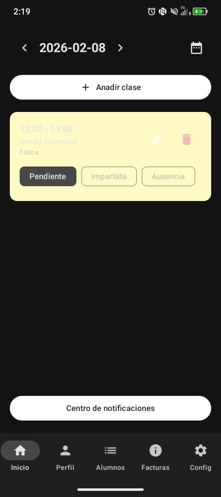

# TimeTutor — Private Tutoring Manager

<p align="center">
  
</p>

<p align="center">
  <strong>Your definitive platform for managing private tutoring sessions</strong>
</p>

<p align="center">
  
  
  
  
</p>

TimeTutor is a comprehensive native Android application designed to centralize and professionalize the administrative and educational management for independent educators. Built under **Clean Architecture** and **MVVM** principles, it solves the fragmentation of generic tools (calendars, spreadsheets, and messaging apps) by providing a unified, scalable, and offline-ready solution.

**Author:** Ismail Haddouche Rhali

---

## What does TimeTutor do?

*   **Role-Based Access Control (RBAC):** Distinct dashboard experiences for **Teacher** (`"profesor"` with full administrative CRUD capabilities) and **Student** (`"alumno"` with read-only schedule and invoice tracking).
*   **Student Life-Cycle Engine:** A robust finite state machine managing student-teacher relationship statuses (`"pendiente"` -> `"activo"` -> `"archivado"` / `"eliminado"`).
*   **Advanced Scheduling & Attendance:** Interactive calendar system to track attendance dates, identify overlaps, and schedule recurring educational sessions.
*   **Automated Billing & Invoicing:** Dynamic pricing categories that generate accurate invoices instantly based on validated attendance (`"impartida"`).
*   **Real-Time Synchronization:** Seamless cross-device data syncing powered by a real-time NoSQL backend.
*   **Offline-First:** Core data persistence allows uninterrupted functionality without internet access.
*   **Push Notifications (TTL):** Instant alerts delivered to students for schedule updates, intelligently managed by a serverless Time-To-Live logic layer to prevent database bloat.

---

## Screenshots

<table>
  <tr>
    <td align="center">
      <br/>
      <em>Authentication Form</em>
    </td>
    <td align="center">
      <br/>
      <em>Teacher Dashboard</em>
    </td>
    <td align="center">
      <br/>
      <em>Student Directory</em>
    </td>
    <td align="center">
      <br/>
      <em>Lesson Scheduler</em>
    </td>
  </tr>
  <tr>
    <td align="center">
      <br/>
      <em>Invoicing Dashboard</em>
    </td>
    <td align="center">
      <br/>
      <em>Student Dashboard</em>
    </td>
    <td align="center">
      <br/>
      <em>Student Invoices</em>
    </td>
    <td align="center">
      <br/>
      <em>Push Notifications</em>
    </td>
  </tr>
</table>

---

## Tech Stack

<p align="left">
  
  
  
</p>

| Layer | Technology |
|------|-----------|
| **Language** | Kotlin Coroutines + Asynchronous `StateFlow` |
| **UI Framework** | Jetpack Compose + Material Design 3 |
| **Architecture** | MVVM + Repository Pattern + Clean Architecture |
| **Navigation** | Navigation Compose (Single Activity) |
| **Database** | Firebase Cloud Firestore (Multi-tenant NoSQL) |
| **Auth** | Firebase Auth (Email/Password, Google Sign-In) |
| **Serverless Ops** | Node.js Cloud Functions (TTL Maintenance) |
| **Image Loading** | Coil (Network caching optimized) |

---

## Documentation

For a deeper dive into the system design, database architecture, and application flows, please refer to the dedicated documentation files:

| Document | Description |
|-----------|-------------|
| [docs/ARCHITECTURE.md](docs/ARCHITECTURE.md) | Detailed breakdown of the MVVM pattern, the Clean Architecture Repository layer, and the Jetpack Compose navigation structure. |
| [docs/DATABASE_SCHEMA.md](docs/DATABASE_SCHEMA.md) | complete mapping of the NoSQL collections, foreign keys, and E-R diagrams. |
| [docs/USER_FLOWS.md](docs/USER_FLOWS.md) | Comprehensive explanation of the capabilities and finite state machine flows separating Teacher and Student roles. |

---

## Setup & Local Environment

This project relies on secure configuration files that are purposefully **omitted** from version control in accordance with security best practices to protect sensitive system credentials.

### Prerequisites

- Android Studio (latest version recommended)
- Java Development Kit (JDK 11 or 17)
- A Firebase Project environment registered for Android.

### 1. Configure Firebase Credentials

To build and run this application cleanly from source, you must configure your own Firebase project credentials:

1. Generate your `google-services.json` file securely from the Firebase Developer Console.
2. Locate the provided template: `app/google-services-example.json`.
3. Save your generated JSON as `app/google-services.json`. *(This explicit file is naturally ignored by Git to prevent secret leakage).*

### 2. Keystore Configuration (Production Builds)

If you are securely compiling a signed production `<Release>` APK, set up your local keystore configuration:

1. Create a `keystore.properties` file in the project's root directory:
   ```properties
   storeFile=your_secure_keystore.jks # Keep this strictly local
   storePassword=your_keystore_password
   keyAlias=your_key_alias
   keyPassword=your_key_password
   ```

### 3. Build and Run

Sync your project dependencies with Gradle plugins and launch locally to an emulator or physical testing device via Android Studio:
```bash
./gradlew assembleDebug
```

---

## Security & Privacy Model

Data integrity and privacy are enforced at the edge layer by **Firestore Security Rules**. Multi-tenant data segregation isolates educator data, dynamically ensuring each profile can only ever read and mutate their conditionally generated classrooms, administrative invoices, and active student connections. This design secures enterprise-grade compartmentalization even within a serverless ecosystem.

---

## License

This project is released under the [MIT License](./LICENSE).
