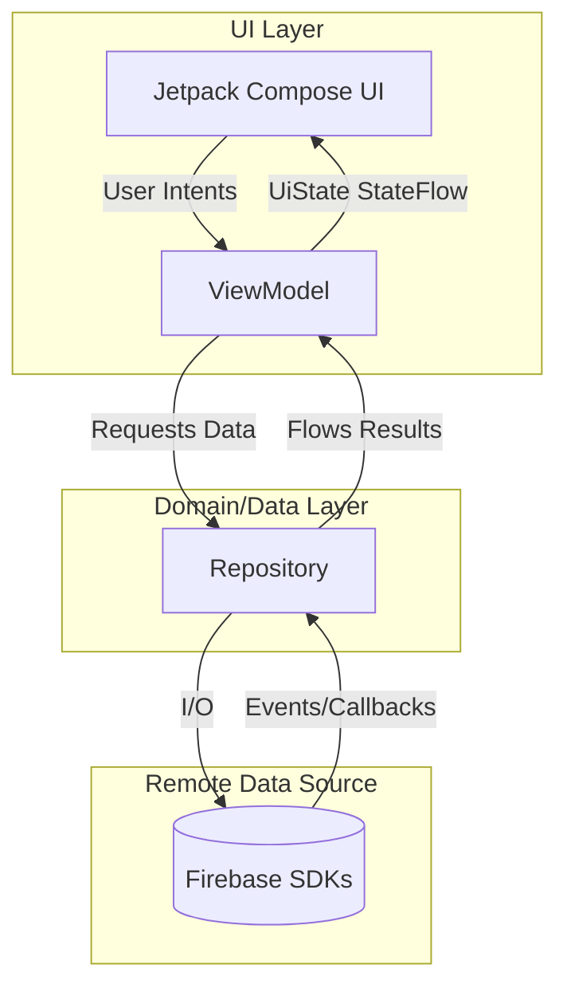

# TimeTutor Architecture

This document describes the high-level software architecture and tech stack powering the TimeTutor Android application.

## 1. Architectural Pattern: MVVM + Repository
TimeTutor is meticulously designed using the **Model-View-ViewModel (MVVM)** architectural pattern alongside a strict Clean Architecture **Repository Layer**. This enforces separation of concerns:

- **UI / Presentation Layer (Jetpack Compose):** Functions purely as an observer. It renders data provided by the ViewModels and passes user actions back.
- **ViewModel Layer (StateFlow):** Holds state (`UiState`) using asynchronous `StateFlow` and Coroutines. It processes logic and format updates without locking the Main thread, surviving configuration changes smoothly.
- **Data / Repository Layer:** The centralized single-source of truth. It abstracts Firebase SDK implementation details away from the app. Replacing Firestore with a REST API backend in the future would only require modifying this layer.

### Core Repositories
*   `UserRepository`: Provides clean profile access and handles caching.
*   `AuthRepository`: Maps `FirebaseAuth` routines (email/password & Google identity).
*   `FirestoreRepository`: Shared core module for NoSQL query coordination, atomic batching, and Real-Time persistence.
*   `NotificationRepository`: Fires payloads through Cloud Messaging.

## 2. Serverless Backend (Google Firebase Ecosystem)
We eliminated traditional backend maintenance by using Firebase.

- **Authentication:** Managed sessions with secure JWT tokens. Role selection (Teacher/Student) is cleanly handled on account creation.
- **Cloud Firestore (NoSQL):** Powers real-time multi-tenant data sync. Features localized persistence making the app explicitly **Offline-First**.
- **Firebase Cloud Messaging (FCM):** Push notifications driven via HTTP endpoints. 
- **Cloud Functions (Node.js):** Executing automated triggers in the background. Currently handling Time-To-Live (TTL) deletion logic (e.g., purging old notifications after 30 days) to keep database sizes lean.
- **Firebase Cloud Storage:** Secures media assets (e.g., user profile pictures).

## 3. UI Framework & Navigation
- **Jetpack Compose Native UI:** Written purely in Kotlin declaring "what" the UI looks like rather than how to manipulate XML, drastically improving performance and lowering code-verbosity.
- **Navigation Compose:** Employing a strict **Single Activity Architecture**. Everything transitions through composable paths rather than multiple activities or XML fragments.

## 4. Scalability & Edge Security
- **Data Segregation:** Database Collections enforce hard constraints via Firestore Security Rules. A user can only pull lessons bound to their `teacherUid` or `studentUid`.
- **Query Optimizations:** Frequently accessed strings (like names inside lists) are deliberately denormalized into top-level documents to lower read operations, increasing app speeds and halving read costs in Firebase.
