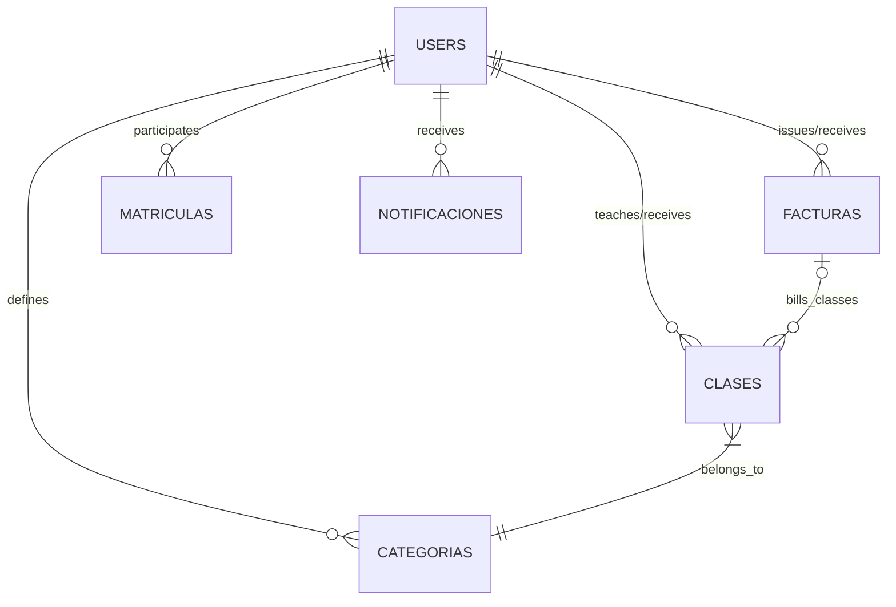

# Database Schema Reference (Firestore NoSQL)

TimeTutor uses **Google Cloud Firestore**, a highly scalable document-store database. The schema has been carefully adapted from a traditional Entity-Relationship model (E-R) into a flattened NoSQL hierarchy favoring query speed and minimizing multiple-read operations via tactical denormalization.

## Data Collections

The system handles 7 main interlinked collections maintaining relational integrity via Foreign Keys.

### 1. `users`
Acts as a unified auth table using an internal `role` discriminator to avoid checking across multiple tables.
- **Key Fields:** `uid` (Primary Key), `email`, `role` (`"profesor"` | `"alumno"`), `firstName`, `lastName`, `phone`, `photoUrl`
- **Teacher Extensions:** `calendarName`
- **Student Extensions:** `tutorWhatsapp`, `tutorEmail`

### 2. `matriculas` (Enrollments)
Serves as an N:M join-table equivalent. It represents the lifecycle instance of a student's connection to a teacher.
- **Key Fields:** `id` (`teacherUid_studentUid`), `teacherUid` (FK), `studentUid` (FK), `status` (Finite State Machine: `"activo"`, `"pendiente"`, `"eliminado"`, `"archivado"`), `updatedAt`

### 3. `clases` (Lessons/Sessions)
Holds all scheduled sessions, including recurring data and attendance status.
- **Key Fields:** `id`, `teacherUid` (FK), `studentUid` (FK), `date`, `startTime`, `endTime`, `status` (`no_impartida`, `impartida`, `ausencia`), `categoryId` (FK), `color`, `isBilled` (Boolean), `invoiceId`
- **Denormalized Fields for Query Speed:** `teacherName`, `studentName`, `categoryName`

### 4. `facturas` (Invoices)
Generated bills for completed lessons.
- **Key Fields:** `id`, `teacherUid` (FK), `studentUid` (FK), `date`, `totalAmount`, `paid`, `lessonIds` (Array of Strings)
- **Denormalized Snapshot Fields:** `studentName`, `studentLastName`, `studentWhatsapp`, `studentEmail` (These prevent historical invoices from changing if a user alters their current profile).

### 5. `categorias` (Pricing Categories)
Stores pricing matrices customized differently per teacher.
- **Key Fields:** `id`, `teacherUid` (FK), `name` (e.g., "Advanced Math"), `hourlyRate`

### 6. `notificaciones` (Alerts & System Messages)
Alert payloads with automated expiration.
- **Key Fields:** `id`, `targetUid` (FK), `title`, `message`, `timestamp`, `read` (Boolean), `expiresAt` (TTL Timestamp to trigger auto-purge).

### 7. `invitationCodes`
Temporary 6-character access codes for the student enrollment flow.
- **Key Fields:** `code`, `teacherUid`, `expiresAt` (48-hour lifetime).
