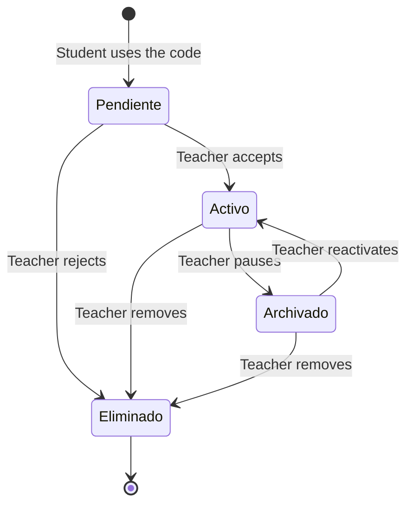
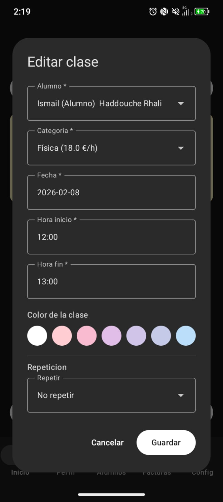
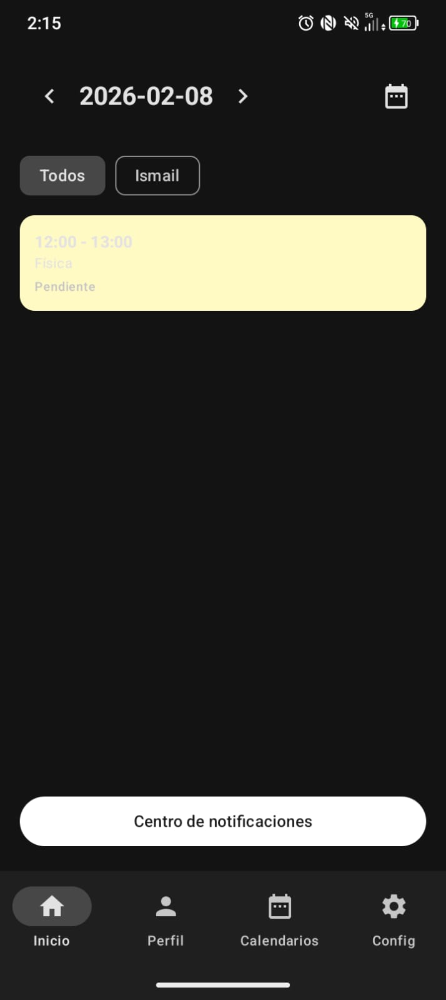

# Application Features & User Flows

TimeTutor leverages a hard-coded **Role-Based Access Control (RBAC)** environment separating administrative management powers from student observer features.

---

## The Teacher Role (Administrator)
Educators have full CRUD (Create, Read, Update, Delete) access isolated purely to their own domain. Upon successfully creating an account and selecting the `"profesor"` role, following capabilities are unlocked:

1. **Student Life-Cycle Management System**
   - Teachers generate secure `invitationCodes` valid for exactly 48 hours.
   - When a student redeems a code, a `matricula` edge is established inside the database.
   - The teacher commands a Finite State Machine managing this relationship:

     
   

2. **Scheduling & Classes**
   - Plugs directly into the daily & weekly agenda views.
   - Attach classes manually to active students applying customizable `categories` (pricing).
   - Flag classes retroactively as `"impartida"` (Attended), `"ausencia"` (Absent), or `"no_impartida"` (Pending). Only `"impartida"` classes merge into the billing queue.
   
   

3. **Financial Dashboard (Invoicing)**
   - Single-click invoice generation instantly filters all attended, un-invoiced lessons (`isBilled=false`) associated with a given student.
   - Flattens the variable `hourlyRate` of multiple classes into a clean, itemized virtual receipt.
   
   

## The Student Role (Observer)
Tailored to provide transparency. The application acts strictly as an information portal preventing accidental scheduling mistakes. 

1. **Dashboard Overview**
   - Clean calendar UI extracting lessons targeted exclusively at their `uid`.
   - Cannot mutate dates or mark attendance, securing the integrity of the tutor's ledger.
   
   

2. **Joining New Teachers**
   - Through a streamlined code-entry portal, students can inject a `teacherUid` into their profile, pushing an enrollment request (`estado="pendiente"`) directly to the teacher's pending queue.

3. **Invoice Auditing**
   - Tracks ongoing accrued costs natively, and holds a history of fully generated invoices alongside payment status toggles dictated by the educator.
   
   

## Automated Communication Engine
As users perform changes, the backend gracefully orchestrates asynchronous **Push Notifications**:
- Invites / Status changes trigger enrollment alerts.
- New lessons trigger schedule-sync prompts.
- Emitted invoices ping students instantly.
